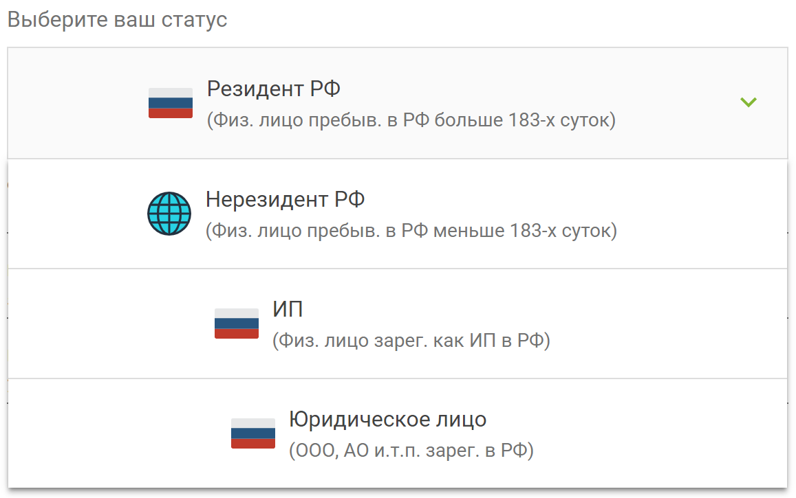
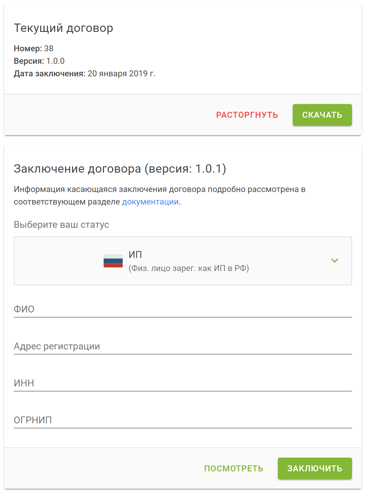

# Заключение договора

Заключение агентского договора необходимо в случае, если вы планируете размещать элементы на основе коммерческой лицензии(ESCL).

## Предисловие

Перед рассмотрением необходимых действий, мы хотим обратить ваше внимание на некоторые моменты.

Мы постоянно думаем и работаем над оптимизацией процессов. Стараемся минимизировать действия пользователей, которые требуются для достижения их целей. 

Изначально мы планировали осуществлять взаимодействие с пользователями, только на основе условий использования 01HT, однако для законодательства РФ этого оказалось недостаточно и пришлось искать другие варианты для законной сделки. Таким вариантом оказался агентский договор.

Мы постарались реализовать такой договор, который позволяет осуществлять все взаимодействия дистанционно с минимумом необходимых действий. То есть для его заключения вам не придется его печатать, подписывать, отправлять по почте, ждать пока он придет к нам. Также вам не потребуется тратить деньги на покупку ЭЦП и вникать в действия, которые требуются для подписи документов дистанционно. Для заключения, перезаключения на новых условия и расторжения договора, достаточно заполнить несколько полей и сделать акцепт.

Также хотим обратим внимание на выглядящие на первый взгляд "суровые" возможности беспрепятственного расторжения договора с обеих сторон в любое время. Опять же сделано это в целях удобства взаимодействия сторон. Подобная возможность расторжения договора позволяет нам, в рамках законодательства РФ, совершенствовать наш договор и вносить в него изменения, избегая множества времязатратных взаимодействий сторон, в случае "классического" внесения изменений.

В целом рекомендуем относиться к договору как к некой формальности связанной с законодательством РФ. Хотя договор есть и условия его необходимо выполнять, для нас куда более приоритетнее исполнение вами Условий использования и написанного в Документации, так как именно в этих местах описаны процессы и основные составляющие взаимоотношений сторон. Возможно в будущем мы сможем избавиться от необходимости заключения договора.

Мы продолжаем поиски путей для достижения максимальной оптимизации процессов, если у вас есть идеи и предложения, пишите нам. 

Рассмотрим как происходит заключение, перезаключение и расторжение договора.

## Заключение договора

Для заключение договора перейдите на страницу [Настройки договора](/guide/contract/).

Выберите из выпадающего меню ваш налоговый статус:

    

* Резидент РФ
* Нерезидент РФ
* ИП РФ
* Юридическое лицо РФ

Заполните появившиеся поля формы.

Вы можете посмотреть как будет выглядеть договор скачав его в формате .pdf нажав `Посмотреть`.

Для заключения договора нажмите кнопку `Заключить`.

При заполнении формы перепроверяйте корректность введенных вами данных, так как ошибки в данной форме могут привести нас к штрафам со стороны государственных структур.

В случае, если причиной штрафа, будет некорректное предоставление данных с вашей стороны, сумма штрафа будет удержана из вашего баланса.

Также не забывайте поддерживать ваши данные в договоре в актуальном состоянии. В случае изменения данных перезаключите договор с указанием новых данных.

## Перезаключение договора

Перезаключение договора обычно необходимо:

* в случае появления новой версии договора

    

В случае появления новой версии договора, мы уведомляем об этом пользователей отправляя письмо на электронную почту. В нем мы детально описываем внесенные изменения в сравнении с предыдущей версией договора. Для заключения договора на новых условиях достаточно перейти в раздел [Настройки договора](/guide/contract/) и нажать кнопку `Заключить`. Сделать это можно в течение 30 дней. Если через 30 дней договор не перезаключен, то текущий договор будет автоматически расторгнут и коммерческие элементы будут скрыты в каталоге, до момента заключения нового договора.

* если у вас сменился налоговый статус или реквизиты

В случае если вы сменили налоговый статус(к примеру были резидентом, а стали ИП) или у вас сменились реквизиты указанные в договоре, то расторгните текущий договор нажав `Расторгнуть`, укажите новые реквизиты и нажмите `Заключить`.

Обращаем внимание, что при перезаключении договора все результаты сделок и прочая информация остаются без изменений.

## Расторжение договора

Расторгнуть договор можно в любой момент нажав `Расторгнуть`. Обычно договор расторгается в случае необходимости перезаключения.
