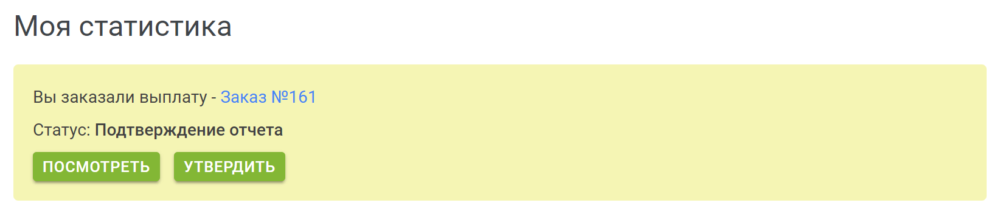

# Выплата вознаграждения

Для осуществления выплаты, вы должны сделать заказ на выплату в разделе [Моя статистика](/guide/my-statistics/).

Заказ можно сделать в любое время при условии, что:

* вы заключили [агентский договор](/guide/conclusion-contract/)
* вы указали [настройки выплат](/guide/account/#настройки-уведомnений)
* текущий баланс больше или равен минимальной сумме выплаты
    * при выплате на банковскую карту или банковский счет это 3 000 RUB
    * при выплате используя SWIFT это 30 000 RUB

Также заказ на выплату может быть создан со стороны администрации Elements (обычно такой заказ формируется раз в год, перед уплатой компанией налогов).

С 1 по 10 числа каждого месяца, мы обрабатываем заказы на выплату, формируем отчеты с детальной информацией по осуществленным сделкам, ждем утверждения отчета с вашей стороны, после чего осуществляем выплату.

Выплата осуществляется по всем сделкам осуществленным до формирования отчета.

Перед тем как перейти к деталям, рассмотрим наиболее важный момент на который вам надо обратить внимание, а именно налоги, страховые взносы и комиссия банка.

## Налоги и страховые взносы

Компания 01HT зарегистрирована в России и по закону является [налоговым агентом](https://ru.wikipedia.org/wiki/%D0%9D%D0%B0%D0%BB%D0%BE%D0%B3%D0%BE%D0%B2%D1%8B%D0%B9_%D0%B0%D0%B3%D0%B5%D0%BD%D1%82).

То есть, в определенных случаях, мы обязаны оплатить за вас налоги и страховые взносы.

### Физические лица

Если вы физическое лицо, то налоги, а именно НДФЛ, по закону мы не удерживаем. То есть данный налог вам придется оплатить самостоятельно.

В зависимости от указанных вами данных при [заключении договора](/guide/conclusion-contract/), мы выплачиваем за вас страховые взносы в ПФР и ФФОМС.

Если вы не являетесь гражданином РФ и постоянно проживаете за пределами РФ, то страховые взносы за вас не выплачиваются.

В большинстве случаев размер страховых взносов составляет:

* ПФР - 22%
* ФФОМС - 5.1%

Обращаем ваше внимание, что мы выплачиваем взносы, за свой счет, а не удерживаем их из полагающейся вам суммы выплаты.

То есть, по агентскому договору мы выплачиваем вам 70% от суммы сделок, после чего перечисляем в страховые фонды сумму в размере 27.1% от выплаченных вам 70%, **за свой счет**.

В случае, если размеры выплат вам с начала года превысят 1 150 000 руб., то взнос в ПФР будет осуществляться по ставке 10%.

**Для пенсионеров**

Обратите внимание, что мы отправляем ежемесячную отчетность в ПФР о физических лицах с которыми у нас заключен агентский договор. То есть если вы пенсионер, то информация о том, что вы работаете по договору, будет зафиксирована в ПФР и в итоге это может как-то на вас повлиять. Отправка отчетности осуществляется на протяжении всего периода действия договора, независимо от того осуществляются вам выплаты или нет.

### Юридические лица и индивидуальные предприниматели

Если вы юридическое лицо или индивидуальный предприниматель, то налоги и страховые взносы вы оплачиваете самостоятельно.

## Комиссия банка за выплаты

Комиссия банка за осуществление выплаты оплачивается за счет 01HT.

## Настройки выплат

Настройка выплат осуществляется в разделе [Настройки выплат](/guide/account/#настройки-выпnат).

Здесь вы можете указать платежные реквизиты на которые будет осуществлена выплата.

Для указания настроек, необходимо заполнить поля формы и нажать `Сохранить`.

При заполнении формы перепроверяйте корректность введенных данных, так как ошибки могут привести к отправке денег на счета третьих лиц и вернуть их назад в добровольном порядке будет не так просто или вовсе невозможно.

Также не забывайте поддерживать данные этой формы в актуальном состоянии.

Для настройки выплат выберите из выпадающего меню ваш способ выплаты:

    

* Банковская карта
* Банковский счет
* SWIFT

Заполните все поля формы и нажмите Сохранить.

## Заказ выплаты

В случае, если вы заключили агентский договор, указали настройки выплат и баланс равен или превышает минимальную суммы выплаты, то вы можете сформировать заказ на выплату на странице [Моя статистика](/guide/my-statistics/).

Нажмите `Выплатить` затем `Создать`, после этого будет сформирован заказ на выплату.

    

В период с 1 по 10 число месяца, мы сформируем отчет с деталями сделок и итоговой суммой выплаты, после чего уведомим вас по email о необходимости утверждения отчета.

    

После утверждения вами отчета мы осуществляем выплату.

Информация о заказе, вместе с отчетом будет храниться в разделе [Мои заказы](/guide/my-orders/).

