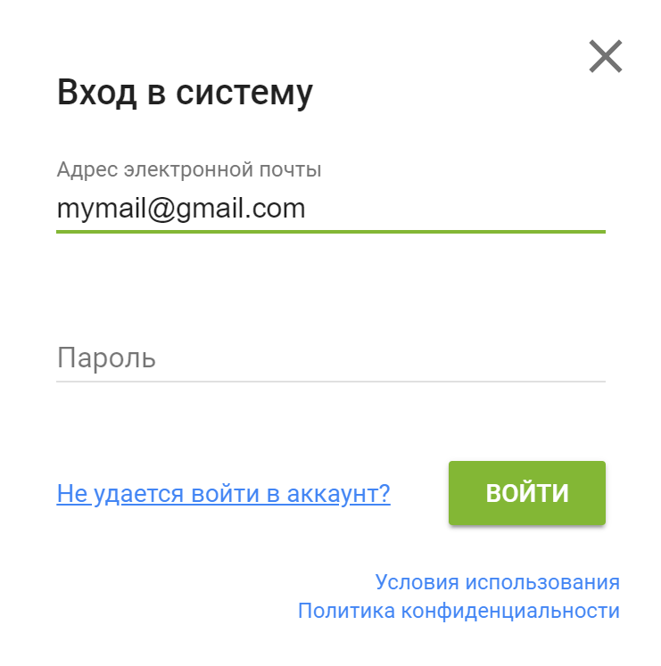

# Регистрация и вход

[https://elements.01.ht](https://elements.01.ht)

Регистрация и вход, необходимы для предоставления всего пользовательского функционала приложения Elements.

Зарегистрироваться и войти можно на любой странице приложения Elements.

При регистрации происходит создание аккаунта, который работает во всех приложениях 01HT.

Для регистрации или входа нажмите на кнопку "Войти" в правом верхнем углу экрана.

    

    

## Регистрация

Есть два варианта регистрации:

* Через ваш аккаунт в социальной сети
    * Google
    * Facebook
    * Twitter
    * GitHub

* Через вашу электронную почту

### Регистрация через социальные сети

Для регистрация через социальные сети:

1) Нажмите на кнопку "Войти"
2) Нажмите на кнопку с названием социальной сети
3) В новом открывшемся окне войдите в аккаунт или выберите из списка аккаунт, который вы хотите использовать
4) Укажите ваш адрес электронной почты

    

Указание адреса вашей электронной почты необходимо в случае если:

* если для работы в используемой вами социальной сети указание электронной почты необязательно (то есть к примеру регистрация и вход осуществляется с помощью телефона)
* если социальная сеть не предоставила нам адрес электронной почты из-за установленных ограничениях в настройках политики безопасности социальной сети

5) Подтвердите ваш адрес электронной почты

Необходимо для всех вариантов, кроме входа через Google.

    

6) Готово

После выполненных шагов, на основе информации из вашего аккаунта в социальной сети будет создан аккаунт 01HT и вы автоматически войдете в приложение Elements.

::: warning Внимание
Из вашего социального аккаунта мы используем только:
* ваш адрес электронной почты
* ссылку на аватар
* отображаемое имя
:::

### Регистрация через электронную почту

Для регистрации через электронную почту:

1) Нажмите на кнопку "Войти"
2) Нажмите на "Войти через почту"
3) Введите ваш адрес электронной почты и нажмите "Далее"
4) Введите пароль, который будет использоваться для входа в аккаунт 01HT и нажмите "Сохранить"
5) Подтвердите ваш адрес электронной почты
4) Готово

Теперь вы можете войти в аккаунт 01HT используя адрес электронной почты и пароль.

## Вход

Для входа нажмите кнопку "Войти" и выберите предпочитаемый вариант входа, через социальную сеть или почту.

::: warning Внимание
Вы можете использовать различные аккаунты социальных сетей для входа, главное, чтобы адрес электронной почты у этих аккаунтов совпадал (в данном случае будет происходить закрепление варианта входа за одним аккаунтом). В противном случае будет создаваться новый аккаунт.
:::

## Восстановление доступа к аккаунту

Если для входа вы используете социальные сети, то восстановление доступа осуществляется на стороне используемой вами социальной сети.

Если для входа вы используете электронную почту, то воспользуйтесь функцией восстановления пароля, нажмите "Не удается войти в аккаунт?" и следуйте дальнейшим инструкциям.

    

## Политика конфиденциальности и условия использования

Когда вы регистрируетесь или входите в аккаунт, вы тем самым принимаете [политику конфиденциальности](https://01.ht/privacy) и [условия использования](https://01.ht/terms) 01HT. Рекомендуем ознакомиться с этими документами один раз. В дальнейшем, в случае внесения важных изменений, мы будем уведомлять пользователей о необходимости ознакомления по электронной почте.