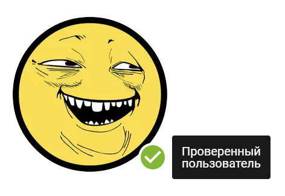

# Проверенный пользователь

У пользователей и организаций, которых мы идентифицировали, на аватаре размещается зеленая иконка, при наведении на которую появляется надпись "Проверенный пользователь".

    

Данная иконка означает, что это не вымышленный пользователь и в с случае чего его можно найти. Соответственно наличие данной иконки снижает риск натолкнуться на злоумышленников и их вредоносный код.

Идентификация пользователя происходит в одном из вариантов:

* если мы осуществляли выплату пользователю
* если мы знаем про существование пользователя, связались с ним лично и удостоверились, что это его аккаунт

На данный момент, нет необходимости в наличии данной метки, для обычных пользователей. 

Для авторов элементов, потребность в этой метке есть и мы со своей стороны будем 
стараться идентифицировать всех авторов публикующих свои элементы.

Как вариант, пока мы вас не идентифицировали, для большего доверия к вам со стороны пользователей, вы можете указать подробную информацию о себе, местах работы и указать ссылки на свои социальные аккаунты, на вашей личной странице, заполнив данные на странице [Личная информация](https://elements.01.ht/account/personal).